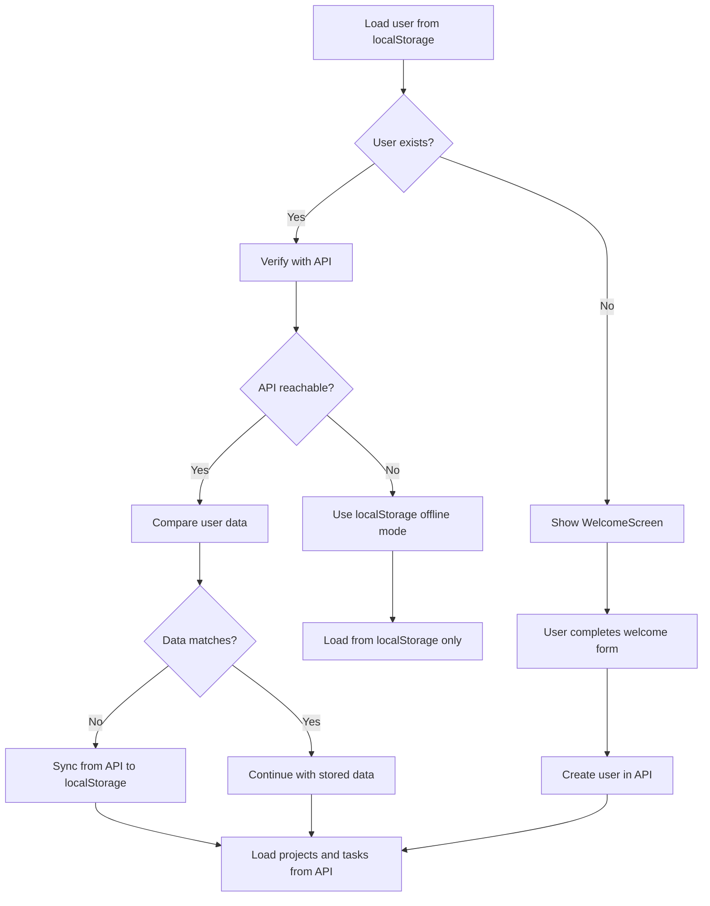

# User Synchronization Flow

This document explains how user data is synchronized between localStorage and the API database.

## Overview

The app maintains user data in two places:
1. **localStorage** - Browser storage (fast, offline-capable)
2. **Neon Postgres** - Cloud database (persistent, multi-device)

On every page load, the app compares and syncs these two sources to ensure consistency.

## Synchronization Flow

### 1. Page Load Initialization

```
Page loads
    ↓
AppContext useEffect() triggers
    ↓
loadData() executes
```

### 2. User Verification Process



### 3. Detailed Steps

**Step 1: Check localStorage**
```javascript
const storedUser = storage.getUser();
```

**Step 2: If user exists, verify with API**
```javascript
const apiUser = await userApi.getUser(storedUser.email, storedUser.name);
```

**Step 3: Compare data**
```javascript
if (apiUser.name !== storedUser.name || apiUser.id !== storedUser.id) {
  // Sync from API (source of truth)
  storage.updateUser(apiUser);
  setUser(apiUser);
}
```

**Step 4: Load data from API**
```javascript
const [projectsData, tasksData] = await Promise.all([
  projectsApi.getAll(),
  tasksApi.getAll()
]);
```

## User Data Structure

### localStorage Format
```javascript
{
  name: "John Doe",
  email: "john@example.com"
}
```

### API Database Format
```javascript
{
  id: 1,                    // Database ID
  name: "John Doe",
  email: "john@example.com",
  created_at: "2024-01-01T00:00:00Z",
  updated_at: "2024-01-01T00:00:00Z"
}
```

### After Sync (localStorage)
```javascript
{
  id: 1,                    // Added from API
  name: "John Doe",
  email: "john@example.com",
  created_at: "2024-01-01T00:00:00Z",
  updated_at: "2024-01-01T00:00:00Z"
}
```

## Scenarios

### Scenario 1: New User

1. User loads app for first time
2. No localStorage user → WelcomeScreen shows
3. User enters name and email
4. App creates user in API: `POST /api/users`
5. API returns user with ID
6. User saved to localStorage
7. Data loaded from API

**Console Output:**
```
No user found, using localStorage
Created new user in API: { id: 1, name: "John", email: "john@example.com" }
Verifying user with API: john@example.com
API user: { id: 1, name: "John", email: "john@example.com" }
Loaded from API: { projects: 0, tasks: 0 }
```

### Scenario 2: Returning User (Data in Sync)

1. User loads app
2. localStorage has user data
3. App verifies with API: `GET /api/users?email=john@example.com`
4. API returns matching user
5. Names match, IDs match → no sync needed
6. Load projects and tasks from API

**Console Output:**
```
Verifying user with API: john@example.com
API user: { id: 1, name: "John", email: "john@example.com" }
Loaded from API: { projects: 5, tasks: 12 }
```

### Scenario 3: User Data Mismatch

This happens if user name was updated in the database by another device or admin.

1. User loads app
2. localStorage has: `{ name: "John" }`
3. API has: `{ id: 1, name: "John Smith" }`
4. Names don't match → sync from API
5. localStorage updated with API data

**Console Output:**
```
Verifying user with API: john@example.com
API user: { id: 1, name: "John Smith", email: "john@example.com" }
Syncing user data from API to localStorage
Loaded from API: { projects: 5, tasks: 12 }
```

### Scenario 4: API Unavailable (Offline Mode)

1. User loads app
2. localStorage has user data
3. App tries to verify with API
4. API request fails (network error, server down)
5. App falls back to localStorage
6. Error state set: "Using offline mode - API unavailable"

**Console Output:**
```
Verifying user with API: john@example.com
API error, falling back to localStorage: Failed to fetch
Using offline mode - API unavailable
```

**UI Behavior:**
- App continues to work with localStorage data
- `error` state is set (can be shown to user)
- All CRUD operations fall back to localStorage
- Data won't sync until API is reachable

### Scenario 5: User Deleted from Database

1. User loads app
2. localStorage has user data
3. API call to get user returns 404 (user deleted)
4. App treats as API error
5. Falls back to localStorage
6. User can continue using app offline

**Note:** This scenario needs better handling. Consider:
- Clearing localStorage if user doesn't exist in API
- Showing "Account not found" message
- Offering re-registration

## Source of Truth

**API Database is the source of truth** for:
- User ID
- User name (if updated elsewhere)
- Created/updated timestamps

**localStorage is fallback** for:
- Offline access
- When API is unreachable
- Fast initial load before API verification

## Error Handling

### Network Errors
```javascript
try {
  const apiUser = await userApi.getUser(email, name);
  // Success - use API data
} catch (apiError) {
  console.error('API error, falling back to localStorage:', apiError);
  // Use localStorage
  setError('Using offline mode - API unavailable');
}
```

### Invalid User Data
If localStorage has invalid data (missing email):
```javascript
if (storedUser && storedUser.email) {
  // Valid user - verify
} else {
  // Invalid - show WelcomeScreen
  setUser(null);
}
```

## API Endpoints Used

### GET /api/users?email=:email
**Purpose:** Get or create user by email

**Request:**
```
GET /api/users?email=john@example.com&name=John
Headers: None required for this endpoint
```

**Response (User exists):**
```json
{
  "id": 1,
  "name": "John",
  "email": "john@example.com",
  "created_at": "2024-01-01T00:00:00Z",
  "updated_at": "2024-01-01T00:00:00Z"
}
```

**Response (User created):**
```json
{
  "id": 2,
  "name": "John",
  "email": "john@example.com",
  "created_at": "2024-01-15T10:30:00Z",
  "updated_at": "2024-01-15T10:30:00Z"
}
```

### PUT /api/users
**Purpose:** Update user name

**Request:**
```json
PUT /api/users
Headers: { "Content-Type": "application/json" }
Body: {
  "email": "john@example.com",
  "name": "John Smith"
}
```

**Response:**
```json
{
  "id": 1,
  "name": "John Smith",
  "email": "john@example.com",
  "created_at": "2024-01-01T00:00:00Z",
  "updated_at": "2024-01-15T11:00:00Z"
}
```

## Console Logging

The sync process includes console logging for debugging:

| Message | Meaning |
|---------|---------|
| `Verifying user with API: email@example.com` | Starting API verification |
| `API user: {...}` | User data received from API |
| `Syncing user data from API to localStorage` | Data mismatch detected, syncing |
| `Loaded from API: { projects: X, tasks: Y }` | Successfully loaded data |
| `API error, falling back to localStorage: Error` | API failed, using offline mode |
| `No user found, using localStorage` | No user in localStorage |
| `Created new user in API: {...}` | New user created successfully |
| `API disabled, using localStorage only` | VITE_USE_API=false |

## Testing User Sync

### Test 1: New User Creation
```bash
# 1. Clear localStorage
localStorage.clear();

# 2. Reload page
# 3. Fill welcome form
# 4. Check console for: "Created new user in API"
# 5. Verify user in database
```

### Test 2: Returning User
```bash
# 1. Reload page with existing user
# 2. Check console for: "Verifying user with API"
# 3. Verify no sync message (data matches)
```

### Test 3: Data Mismatch
```sql
-- 1. Update user name in database
UPDATE users SET name = 'Updated Name' WHERE email = 'test@example.com';

-- 2. Reload app
-- 3. Check console for: "Syncing user data from API to localStorage"
-- 4. Verify localStorage updated
```

### Test 4: Offline Mode
```bash
# 1. Stop API server (stop vercel dev)
# 2. Reload app
# 3. Check console for: "API error, falling back to localStorage"
# 4. Verify app still works
```

## Best Practices

1. **Always include email** in user data
2. **Treat API as source of truth** for user data
3. **Keep localStorage in sync** after updates
4. **Handle offline gracefully** with localStorage fallback
5. **Log sync operations** for debugging
6. **Validate user data** before sync

## Future Improvements

- [ ] Add user sync indicator in UI
- [ ] Show "Offline Mode" badge when API unavailable
- [ ] Handle deleted users more gracefully
- [ ] Add background sync when coming back online
- [ ] Implement conflict resolution for concurrent updates
- [ ] Add user session timeout
- [ ] Cache API responses with TTL
- [ ] Add retry logic for failed API calls
